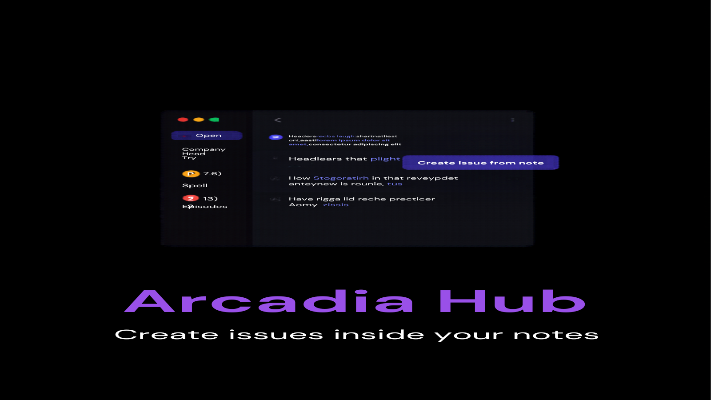

# Arcadia Hub

Arcadia Hub puts your GitHub workflow inside Obsidian. Browse repositories, triage issues, and review pull requests from a sidebar panel, then turn any note into a GitHub issue without leaving your vault. If your project notes and your project code live in different windows, this plugin closes the gap.

> Desktop only.

## Features

| Feature | Free | Premium |
|---|---|---|
| Repository browser with active repo switching | Yes | Yes |
| Issues viewer with open/closed filter, label filter, and pagination | Yes | Yes |
| Pull request dashboard with state and review status | Yes | Yes |
| Create a GitHub issue from the current note | Yes | Yes |
| Auto-refresh on a configurable interval | Yes | Yes |
| Claude Code bridge (in development) | No | Yes |
| Audio notebook sync (in development) | No | Yes |
| AI router (in development) | No | Yes |

The entire GitHub module is free. Premium covers the additional modules listed in settings, which are in development and will ship in future releases. Buying now supports development and unlocks them on arrival.

## Install

Community Plugins listing is pending review. Until it is approved, install with one of these methods:

### BRAT (recommended)

1. Install the [BRAT plugin](https://obsidian.md/plugins?id=obsidian42-brat) from Community Plugins
2. In BRAT settings, choose "Add beta plugin" and enter `Arcadia-Studio/obsidian-arcadia-hub`
3. Enable Arcadia Hub in Settings > Community plugins

### Manual install

1. Download `main.js`, `manifest.json`, and `styles.css` from the latest [GitHub release](https://github.com/Arcadia-Studio/obsidian-arcadia-hub/releases)
2. Create the folder `.obsidian/plugins/arcadia-hub/` in your vault and copy the three files into it
3. Reload Obsidian and enable Arcadia Hub in Settings > Community plugins

## Quick start

1. Generate a GitHub personal access token with `repo` scope at [github.com/settings/tokens](https://github.com/settings/tokens)
2. Open Settings > Arcadia Hub and paste the token
3. Set your default repository in `owner/repo` format
4. Open the hub from the ribbon icon (git branch) or the "Open hub" command

From there: the Issues tab lists open issues with label filtering and pagination, the Pull requests tab shows PR state and review status, and the Repos tab lets you switch the active repository. Run "Create issue from note" in any note to open a pre-filled issue form (selected text becomes the body; with no selection, the full note is used).

## Settings

| Setting | Description | Default |
|---|---|---|
| Personal access token | GitHub token with `repo` scope. Stored locally in this vault's plugin settings and masked in the UI. | empty |
| Default repository | Repository shown on open, in `owner/repo` format | empty |
| Show closed issues | Include closed issues in the issues list | off |
| Issues per page | Number of issues loaded per page (1 to 100) | 25 |
| Auto-refresh interval | Minutes between automatic refreshes; 0 disables | 0 |
| License key | Premium license key with a validate button | empty |

## Pricing

The GitHub module is free, with no account beyond your own GitHub token. Premium modules require a one-time license from [arcadia-studio.lemonsqueezy.com](https://arcadia-studio.lemonsqueezy.com).

To activate: Settings > Arcadia Hub > License key > Validate. Licenses are validated against the Lemon Squeezy API. Once validated, premium keeps working for up to 14 days without a connection to the license server, so an offline stretch never locks you out.

## Network use and privacy

- The plugin calls the GitHub API (`api.github.com`) to list repositories, issues, and pull requests, and to create issues. Your token is sent only to GitHub and stored only in your vault's plugin settings.
- License validation calls the Lemon Squeezy API (`api.lemonsqueezy.com`) and sends only the license key you enter.
- No telemetry, no analytics, no other network calls.

## Support

Questions, bugs, feature requests: [open an issue](https://github.com/Arcadia-Studio/obsidian-arcadia-hub/issues) or email arcadiastudio77@gmail.com.

## License

The plugin code is MIT licensed. See [LICENSE](LICENSE).
